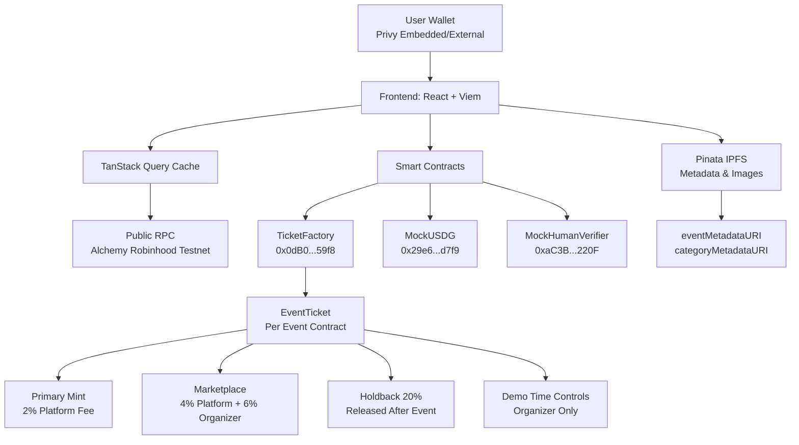
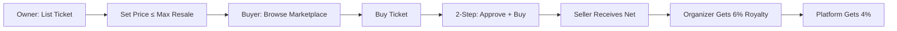

# Chara — RWA Smart Ticketing on Robinhood Chain

**Real-world asset (RWA) ticketing platform where every ticket is an NFT with enforceable royalties, anti-scalping price caps, and on-chain verification.**

[](https://react.dev)
[](https://vitejs.dev)
[](https://tailwindcss.com)
[](https://viem.sh)
[](https://privy.io)
[](https://chain.robinhood.com)

---

## 🎯 Problem & Solution

| Problem | Chara's Solution |
|---------|------------------|
| **Scalping & fake tickets** | Soulbound NFTs — transfers disabled, only marketplace resale before event |
| **No organizer royalties** | 6% royalty on every secondary sale, enforced on-chain |
| **Platform fee opacity** | Transparent 2% primary / 4% secondary fees, visible in contract |
| **Funds locked indefinitely** | 20% holdback released after event ends; organizer withdraws anytime |
| **No identity verification** | MockHumanVerifier (replaceable with Gitcoin Passport / World ID) |
| **Testing on testnet is slow** | Demo time controls — organizer jumps to Running/End instantly |

---

## 🚀 Live Demo & Contracts

| Component | Link |
|-----------|------|
| **Frontend (Deployed)** | [`chara-frontend.vercel.app`](https://chara-frontend.vercel.app) |
| **TicketFactory** | [`0x0dB0a481Ef2d53228eD1dD269dFbc0b9fA2559f8`](https://explorer.testnet.chain.robinhood.com/address/0x0dB0a481Ef2d53228eD1dD269dFbc0b9fA2559f8) |
| **MockUSDG** | [`0x29e688092F42e533A69dB2dA0Df576579a5cd7f9`](https://explorer.testnet.chain.robinhood.com/address/0x29e688092F42e533A69dB2dA0Df576579a5cd7f9) |
| **MockHumanVerifier** | [`0xaC3B0754697BfEB5A094B4578ba46848715C220F`](https://explorer.testnet.chain.robinhood.com/address/0xaC3B0754697BfEB5A094B4578ba46848715C220F) |
| **Robinhood Explorer** | [explorer.testnet.chain.robinhood.com](https://explorer.testnet.chain.robinhood.com) |

> All contracts deployed on **Robinhood Chain Testnet (Chain ID: 46630)**.

---

## 🛠 Tech Stack

| Layer | Technology | Version |
|-------|------------|---------|
| **Framework** | React + Vite | 19 / 8 |
| **Styling** | Tailwind CSS (custom design system) | 4 |
| **Routing** | React Router | 7 |
| **Web3** | Viem + Privy React Auth | 2 / 1.87 |
| **State (Server)** | TanStack Query | 5 |
| **QR Scanner** | `@yudiel/react-qr-scanner` + `html5-qrcode` | 2.6 / 2.3 |
| **QR Generator** | `qrcode.react` | 4.2 |
| **IPFS** | Pinata v3 API | — |
| **Linting** | ESLint Flat Config (react-hooks, react-refresh) | 10 |
| **Testing** | Vitest + React Testing Library (configured) | — |

---

## 🏗 Architecture



---

## ✨ Features

### 1. **Wallet Authentication (Privy)**
- Embedded wallets (email login) + external wallets (MetaMask, etc.)
- Auto chain switching to Robinhood Testnet (46630)
- Persistent sessions, no seed phrase management for users

### 2. **Get Started — Onboarding** (`/get-started`)
- **MockUSDG Faucet**: Claim 1,000 mUSDG (6 decimals) for testing
- **Verify Me**: Call `MockHumanVerifier.verifyMe()` — required for all purchases
- Network info: Chain ID, RPC, Explorer, Contract addresses

### 3. **Explore Events** (`/explore`)
- Fetches all events from `TicketFactory.getDeployedEvents()`
- Displays: Flyer (IPFS), Name, Date, Location, Status Badge
- Status: **Sale Open** / **Live Now** / **Ended** (from `getState()`)
- Click → Event Detail

### 4. **Event Detail** (`/event/:address`) — **Two Tabs**

#### 🛒 **Buy Tab** (Primary Sales)
- Fetches tiers via `getTiers()`, groups by Category → Phase matrix
- Shows: Price (mUSDG), Quota, Minted, Sale Window (start/end)
- **Directed Mint**: Up to 5 recipients per tx, all must be verified + no existing ticket
- **2-Step Transaction**: `approve` USDG → `mint(tierIndex, recipients[])`
- Disabled if: outside sale window, quota full, user unverified

#### 🏪 **Marketplace Tab** (Secondary Sales)
- Iterates `listings` mapping across all minted tokenIds
- Shows: Seller, Price, Max Resale, Category, Phase
- **List**: Owner calls `listTicket(tokenId, price ≤ maxResalePrice)`
- **Buy**: 2-step `approve` → `buyTicket(tokenId)` (buyer verified, no ticket)
- **Cancel**: Seller calls `cancelListing(tokenId)`
- After `eventStartTime`: UI visible but disabled ("Marketplace Closed")

### 5. **My Tickets** (`/my-tickets`)
- Scans all Factory events → `balanceOf(user)` per EventTicket
- Per ticket: Event name, Category, Phase, Token ID, QR Code
- **QR Generator**: EIP-191 `personal_sign` payload
- **Sell Button** → navigates to `/event/:address#marketplace` with tokenId pre-selected
- **Verify Me** button if unverified

### 6. **Organizer Dashboard** (`/dashboard`) — **Most Complex**

#### 📝 **Event Builder (5-Step Draft → Publish)**
| Step | Fields |
|------|--------|
| 1. Event Details | Name, Description, Location, Flyer (local preview), Schedule (multi-day: date + start/end time) |
| 2. Phases | Name, Start Date, End Date → converted to timestamps (00:00:00 / 23:59:59) |
| 3. Categories | Name, Description (optional), Image upload (local preview) |
| 4. Pricing Grid | Phase × Category matrix — each cell: Price + Quota |
| 5. Publish | Upload flyer + category images to Pinata → `ipfs://CID`<br/>Build `TicketTierInput[]` from grid<br/>`simulateContract(createEvent)` → send tx<br/>On success: read `EventCreated` log, clear draft, add to My Events |

- Drafts stored in `localStorage` key `chara:drafts` (multiple drafts supported)
- Live counter: "X/20 tiers" — blocks add if would exceed `MAX_TIERS (20)`
- Empty cells: warning border; all cells required before Publish

#### 📊 **My Events (Published)**
- Reads `deployedEvents` from Factory, filters `organizer() == wallet`
- Per event: 4 counters (Primary Pool, Secondary Pool, Primary Revenue, Secondary Revenue)
- **Withdraw Funds** → `withdrawFunds()` (shows allowable amount preview with holdback)
- **Demo Time Controls**:
  - "Jump to Running" → `advanceTime(seconds to eventStartTime)`
  - "Jump to End" → `advanceTime(seconds to eventEndTime)`
  - "Jump to Phase Start" per phase
  - Custom days input (1-365)

#### 🚪 **Gate Scanner** (Integrated)
- Camera scan via `@yudiel/react-qr-scanner` (html5-qrcode)
- **Fallback**: File upload (QR image) + Manual payload input
- Verify: Recover signer from signature, check `ownerOf(tokenId) == signer`
- Timestamp freshness: ±3 min from raw RPC `block.timestamp` (NOT `_now()`)
- Event state: Must be `EventRunning` via contract `getState()` (uses `_now()`)
- Log to sessionStorage: `tokenId, holderAddress, scannedAt, status, eventAddress`
- Export CSV button

### 7. **Docs** (`/docs`)
Static page with: Overview, Tech Stack, Deployed Contracts (explorer links), Get Started, Key Concepts, Known Limitations, Links

---

## 📜 Smart Contract Deep Dive

### TicketFactory.sol
```solidity
// Deploys new EventTicket contracts
function createEvent(
    string calldata eventMetadataURI,
    uint256 eventStartTime,
    uint256 eventEndTime,
    EventTicket.TicketTierInput[] calldata tierInputs
) external returns (address eventContract)

// Returns all deployed event addresses
function getDeployedEvents() external view returns (address[] memory)
```

### EventTicket.sol — Core Mechanics

| Constant | Value | Description |
|----------|-------|-------------|
| `PRIMARY_FEE_BPS` | 200 | 2% platform fee on primary mint |
| `SECONDARY_PLATFORM_BPS` | 400 | 4% platform fee on resale |
| `SECONDARY_EO_ROYALTY_BPS` | 600 | 6% organizer royalty on resale |
| `HOLDBACK_BPS` | 2000 | 20% revenue locked until event ends |
| `MAX_BATCH_MINT` | 5 | Max recipients per mint tx |
| `MAX_TIERS` | 20 | Max Phase × Category combinations |
| `RESALE_CAP_MULTIPLIER` | 2 | Max resale = 2× highest tier price in category |

#### State Machine (via `_now()` with demo offset)
```solidity
enum State { SaleOpen, EventRunning, Ended }
function getState() view returns (State):
    if (_now() < eventStartTime) return SaleOpen
    if (_now() <= eventEndTime) return EventRunning
    return Ended
```

#### Primary Mint (`mint`)
- Caller must be verified
- Recipients must be verified + no existing ticket
- Payment: `grossAmount = price × qty`
- Platform fee: `grossAmount × 2%` → `platformTreasury`
- Net: `grossAmount - platformFee` → `primaryPool` + `primaryRevenue`
- USDG transferred from caller → contract

#### Marketplace List (`listTicket`)
- Only before `eventStartTime`
- Price ≤ `maxResalePrice` (computed in constructor: 2× highest price in same category)
- Stores `Listing { seller, price }`

#### Marketplace Buy (`buyTicket`)
- Only before `eventStartTime`
- Buyer verified + no existing ticket
- Payment split:
  - Platform: `price × 4%` → `platformTreasury`
  - Organizer royalty: `price × 6%` → `secondaryPool` + `secondaryRevenue`
  - Seller: `price - platform - royalty`
- Ticket transferred via internal `_transfer` (bypasses soulbound restriction)

#### Withdraw Funds (`withdrawFunds`) — Organizer Only
```solidity
function _allowable(pool, revenue) view returns (uint256):
    if (_now() > eventEndTime) return pool  // All unlocked after event
    locked = revenue × 20%  // HOLDBACK_BPS
    return pool > locked ? pool - locked : 0
```

#### Demo Time (`advanceTime`) — Organizer Only
- Increments `demoTimeOffset` → affects `_now()` = `block.timestamp + demoTimeOffset`
- Used for testing state transitions instantly

#### Soulbound Enforcement
```solidity
function transferFrom() pure override { revert("Transfers disabled: use marketplace"); }
function approve() pure override { revert("Approvals disabled"); }
function setApprovalForAll() pure override { revert("Approvals disabled"); }
function _update() internal override:
    if (from != address(0) && _now() >= eventStartTime) revert MarketplaceClosed()
```

---

## 🔐 QR Code & Gate Scanner

### Payload Format (encoded in QR)
```
{contractAddress}|{tokenId}|{timestamp}|{chainId}
```
**Example**: `0xAbC...123|456|1700000000|46630`

### Signature (EIP-191 `personal_sign`)
- Generated via `walletClient.signMessage({ message: payload })`
- Displayed below QR as truncated address: `Signed: 0x1234...5678`
- **Not embedded in QR** — provided separately for scanner verification

### Scanner Validation (`GateScanner.jsx`)
1. Parse payload → extract `contractAddress`, `tokenId`, `timestamp`, `chainId`
2. Verify `contractAddress` matches current event
3. Check local deduplication: token not scanned this session
4. Call `ownerOf(tokenId)` on-chain
5. **Recover signer from signature** (off-chain `ecrecover`)
6. Verify recovered signer == `ownerOf(tokenId)`
7. Check timestamp freshness: `|now - timestamp| ≤ 180 seconds`
8. Verify event state == `EventRunning` (uses contract `_now()`)
9. Log result to sessionStorage + display VALID/INVALID
10. Export all logs as CSV

---

## 👥 User Flows

### Attendee Flow

```mermaid
flowchart LR
    A[Connect Wallet] --> B[Claim mUSDG Faucet]
    B --> C[Verify Me]
    C --> D[Browse /explore]
    D --> E[Select Event]
    E --> F[Choose Tier + Recipients]
    F --> G[Approve USDG]
    G --> H[Mint Tickets]
    H --> I[View QR in /my-tickets]
    I --> J[Show QR at Gate]
    J --> K[Scanner Validates]
```


### Organizer Flow
```mermaid
flowchart LR
    A[Connect Wallet] --> B[/dashboard → Event Builder]
    B --> C[Fill 5 Steps]
    C --> D[Publish → Deploy Contract]
    D --> E[Event Appears on /explore]
    E --> F[Monitor Sales in My Events]
    F --> G[Withdraw Funds (with holdback)]
    G --> H[Time Controls for Demo]
    H --> I[Gate Scanner on Event Day]
    I --> J[Export CSV Logs]
```

### Resale Flow


---

## 🚀 Getting Started

### Prerequisites
- Node.js 18+
- npm / pnpm / yarn
- Privy App ID (get from [privy.io](https://privy.io))
- Pinata JWT (get from [pinata.cloud](https://pinata.cloud))

### Installation
```bash
# Clone
git clone <repo-url>
cd chara-frontend

# Install dependencies
npm install

# Copy environment template
cp .env.example .env
```

### Environment Variables (`.env`)
```bash
# Required
VITE_PRIVY_APP_ID=00000000000000000000
VITE_PINATA_JWT=your_pinata_jwt_here

# Optional (defaults provided)
VITE_RPC_URL=**************
VITE_CHAIN_ID=46630
VITE_TICKET_FACTORY_ADDRESS=0x0000000000000000000000000000000000000000
VITE_MOCK_USDG_ADDRESS=0x000000000000000000000000000000000000000
VITE_MOCK_HUMAN_VERIFIER_ADDRESS=0x000000000000000000
VITE_PINATA_API_KEY=00000000000000000000000
VITE_PINATA_GATEWAY=https://gateway.pinata.cloud
```

### Development
```bash
npm run dev       # Start dev server (Vite)
npm run build     # Production build
npm run preview   # Preview production build
npm run lint      # Run ESLint
```

---

## 📁 Project Structure

```
chara-frontend/
├── public/                 # Static assets (logo, icons, favicon)
├── src/
│   ├── main.jsx           # App entry: Providers (Privy, Query, Router, Toast)
│   ├── App.jsx            # Routes definition
│   ├── config/            # Contract addresses, ABIs, chains, constants
│   │   ├── chains.js      # Robinhood Testnet config
│   │   ├── contracts.js   # Contract addresses + Pinata config
│   │   ├── constants.js   # Fee BPS, limits, decimals
│   │   └── index.js       # Barrel export
│   ├── contracts/
│   │   └── abis/          # JSON ABIs: TicketFactory, EventTicket, MockUSDG, MockHumanVerifier
│   ├── hooks/             # Custom React hooks
│   │   ├── useContractRead.js    # Generic read + specialized (useEventData, useUserTickets, etc.)
│   │   ├── useContractWrite.js   # 2-step tx (approve → write) with toast feedback
│   │   ├── useEventDrafts.js     # localStorage CRUD for drafts
│   │   ├── usePrivyWallet.js     # Viem wallet client from Privy
│   │   └── useToast.jsx          # Toast context
│   ├── utils/
│   │   ├── viemHelpers.js  # simulateContract, readContract, waitForTransactionReceipt
│   │   ├── pinata.js       # uploadToPinata, uploadJSONToPinata, fetchWithGatewayFallback
│   │   ├── qr.js           # createQRPayload, signQRPayload, parseQRPayload, isQRFresh
│   │   └── formatters.js   # formatUSDG (6 decimals), formatTime, shortAddress
│   ├── components/
│   │   ├── ui/             # Button, Input, Modal, Badge, Card, Tabs, ToastProvider
│   │   ├── layout/         # PageWrapper, Navbar
│   │   └── ticket/         # QRCodeModal, QRCodeDisplay, GateScanner
│   ├── pages/
│   │   ├── Explore.jsx           # Event catalog
│   │   ├── EventDetail.jsx       # Buy + Marketplace tabs
│   │   ├── OrganizerEventDetail.jsx # Organizer view + scanner + time controls
│   │   ├── MyTickets.jsx         # User inventory + QR
│   │   ├── Dashboard.jsx         # Event Builder + My Events
│   │   ├── GetStarted.jsx        # Faucet + Verify
│   │   ├── Docs.jsx              # Static docs
│   │   ├── TicketDetail.jsx      # Single ticket + QR + Sell
│   │   └── GateScannerPage.jsx   # Standalone scanner
│   └── styles/
│       └── index.css       # Tailwind + custom design system
├── docs/
│   ├── smartcontract/      # Solidity sources (TicketFactory, EventTicket, MockUSDG, MockHumanVerifier, IHumanVerifier)
│   └── abi/                # Compiled ABIs (if available)
├── .env.example
├── package.json
├── vite.config.js
├── eslint.config.js
├── PLAN.md                 # Project plan & acceptance criteria
└── README.md
```

---

## ⚙️ Configuration

### Chain Config (`src/config/chains.js`)
```javascript
export const robinhoodTestnet = {
  id: 46630,
  name: 'Robinhood Chain Testnet',
  network: 'robinhood-testnet',
  nativeCurrency: { name: 'Ether', symbol: 'ETH', decimals: 18 },
  rpcUrls: { default: { http: ['https://robinhood-testnet.g.alchemy.com/v2/...'] } },
  blockExplorers: { default: { name: 'Explorer', url: 'https://explorer.testnet.chain.robinhood.com' } },
  testnet: true,
};
```

### Contract Constants (`src/config/constants.js`)
```javascript
export const CONTRACT_CONSTANTS = {
  PRIMARY_FEE_BPS: 200,           // 2%
  SECONDARY_PLATFORM_BPS: 400,    // 4%
  SECONDARY_EO_ROYALTY_BPS: 600,  // 6%
  HOLDBACK_BPS: 2000,             // 20%
  MAX_BATCH_MINT: 5,
  MAX_TIERS: 20,
  RESALE_CAP_MULTIPLIER: 2,
  FAUCET_AMOUNT: 1000 * 1e6,      // 1000 mUSDG (6 decimals)
  USDG_DECIMALS: 6,
};
```

### Pinata Gateway Fallback Order (`src/utils/pinata.js`)
1. Custom gateway (`VITE_PINATA_GATEWAY`)
2. `https://gateway.pinata.cloud`
3. `https://ipfs.io`
4. `https://cloudflare-ipfs.com`

---

## 🔌 API Reference — Custom Hooks

| Hook | Purpose | Key Returns |
|------|---------|-------------|
| `useContractRead(contract, fn, args)` | Generic read with caching | `{ data, isLoading, error, refetch }` |
| `useFactoryEvents()` | All deployed events from Factory | `{ data: address[], ... }` |
| `useEventData(address)` | Tiers, state, pools, times, organizer | `{ tiers, state, pools, times, organizer, refetch }` |
| `useUserTickets(userAddress)` | All tickets owned across events | `{ data: Ticket[], ... }` |
| `useListings(eventAddress)` | Active marketplace listings | `{ data: Listing[], ... }` |
| `useUSDGBalance(address)` | MockUSDG balance | `{ data: bigint, ... }` |
| `useVerificationStatus(address)` | MockHumanVerifier.isVerified | `{ data: boolean, ... }` |
| `useContractWrite()` | Execute writes (2-step for ERC20) | `{ execute, executeTwoStep }` |
| `useEventDrafts()` | localStorage draft CRUD | `{ drafts, createDraft, updateDraft, ... }` |
| `useWalletClient()` | Viem wallet client from Privy | `{ walletClient, ready, user }` |

---

## ✅ Testing & Quality

### Commands
```bash
npm run lint      # ESLint flat config (react-hooks, react-refresh)
npm run build     # Vite production build
npm run dev       # Development server
```

### Manual Test Checklist (from PLAN.md)
- [ ] Connect wallet (Privy embedded + external)
- [ ] Claim MockUSDG faucet from `/get-started`
- [ ] Verify via MockHumanVerifier
- [ ] Create event draft → Publish → appears on `/explore`
- [ ] Buy tickets (directed mint, max 5 recipients)
- [ ] List ticket on marketplace (price ≤ maxResalePrice)
- [ ] Buy from marketplace
- [ ] Cancel listing
- [ ] Withdraw funds (with holdback logic)
- [ ] Demo time controls (Jump to Running/End)
- [ ] Generate QR for ticket
- [ ] Scan QR at gate (camera + fallback)
- [ ] Export scanner logs to CSV
- [ ] All routes accessible, no console errors
- [ ] `npm run lint` passes, `npm run build` succeeds

---

## ⚠️ Known Limitations (Roadmap)

| Area | Limitation | Future Plan |
|------|------------|-------------|
| **Dark Mode** | Not implemented | Add Tailwind dark mode |
| **Date Picker** | Native `<input type="datetime-local">` | Upgrade to React Day Picker |
| **Indexer** | `/explore` fetches all events on-chain | Add subgraph / indexer for pagination |
| **Real Tokens** | MockUSDG / MockHumanVerifier only | Integrate Paxos USDG, Gitcoin Passport, World ID |
| **Multi-Gate Sync** | Single scanner, local logs | Centralized scanner dashboard |
| **Event Cancellation** | No `cancelEvent()` + refund | Add organizer cancellation with pro-rata refunds |
| **Configurable Fees** | Hardcoded in contract | Factory-admin configurable fees |
| **TypeScript** | JavaScript only | Migrate to TypeScript |
| **Tests** | No test framework configured | Add Vitest + RTL |

---

## 📄 Smart Contract Sources

All contracts in `docs/smartcontract/`:
- `TicketFactory.sol` — Factory deploying EventTicket instances
- `EventTicket.sol` — Main ticketing logic (ERC721 + marketplace + royalties)
- `MockUSDG.sol` — ERC20 with faucet (6 decimals)
- `MockHumanVerifier.sol` — Simple verification registry
- `interfaces/IHumanVerifier.sol` — Verifier interface

ABIs extracted to `src/contracts/abis/*.json`

---

## 🔗 Links

- **Smart Contract Repo**: [`@RajaswaRai/smart_ticket_contracts`](https://github.com/RajaswaRai/smart_ticket_contracts)
- **Dapps Repo**: [`@MuhammadZaidan1/chara-react-dapps`](https://github.com/MuhammadZaidan1/chara-react-dapps)

---

## 📝 License

MIT License — see `LICENSE` file (add if needed).
